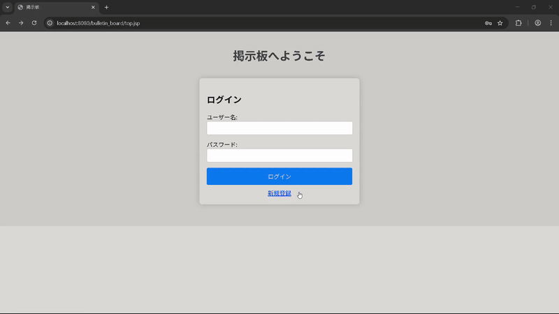

# 掲示板アプリケーション

## 概要
JavaとMySQLを使用して作成したWeb掲示板アプリケーションです。

## 機能
- ユーザー登録（重複チェックあり）
- ログイン / ログアウト
- 投稿機能
- 入力バリデーション
- パスワードはBCryptによりハッシュ化

## 使用技術
- Java / JSP / Servlet
- MySQL / JDBC
- Eclipse / Tomcat
- Git / GitHub

## 実行方法
1.  MySQLをインストール
2. `sql/create_tables.sql` を実行してテーブルを作成
3. Eclipse上でTomcatを起動
4. ブラウザで `http://localhost:8080/プロジェクト名` にアクセス

## Javadoc（APIドキュメント）の利用方法
ソースコードにコメントから生成したJavadocは、`doc/` フォルダに出力されています。  
ブラウザで `doc/index.html` を開くとAPI仕様や各クラスの説明が参照可能です。

もしJavadocを再生成したい場合は、以下の手順で行ってください。  
（Eclipseの場合）
1. メニューの「プロジェクト」→「Javadocの生成」を選択
2. 出力先フォルダに `doc/` を指定
3. 「完了」をクリックすると、`doc/` に最新のJavadocが生成されます

## 参考文献
- 国本大悟. スッキリわかるサーブレット＆JSP入門 第4版, インプレス, 2025.
